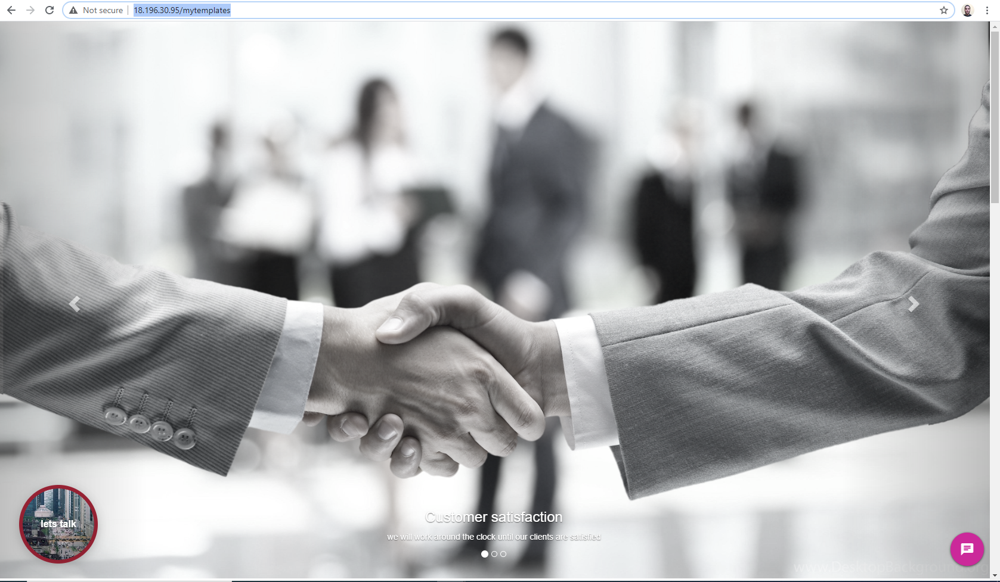
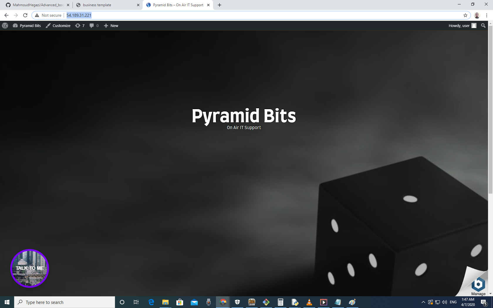

# Advanced_bootstrab-tempalte
here is my number1 project, I did every single line in it, it uses bootstrap, CSS, HTML5, 
JS it connected with ng desk server and has video chat 

checkit on my own server not http (open widget in new page (due to no data encryption for cst data and 
connection I requested new SSL certificate and soon it will be htpps 
http://18.196.30.95/mytemplates

Check it on Https link in order video work inside the screen:
https://unbetrayedsocks.htmlpasta.com/

check it on my wordpress server:

http://54.189.31.221/

## Bootstrap:

## WordPress:

